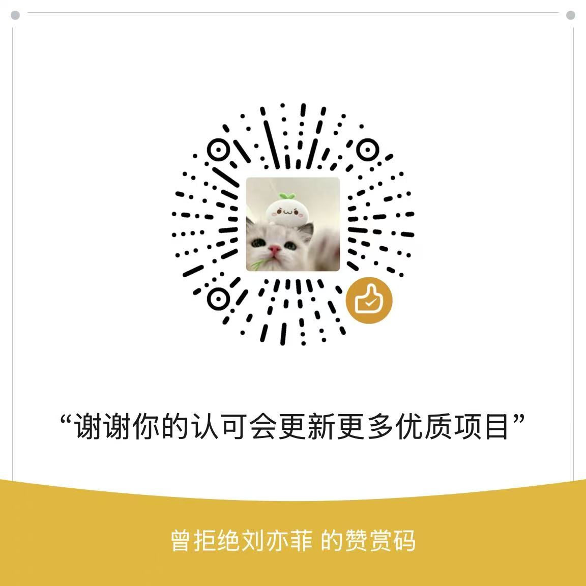

<h1 align="center">delta-game</h1>

<p align="center">
  面向电竞陪玩、游戏代练与线上护航业务的一体化服务平台
</p>

<p align="center">
  
  
  
  
  
  
</p>

---

## 平台简介
> **delta-game 是一套覆盖用户、接单员、客服和平台管理员的电竞服务业务系统。目前全部开源!!!日后不在维护此项目**

> **如有问题请联系 QQ：2104924410。**

> **免备案香港服务器：[https://www.rainyun.com](https://www.rainyun.com/inedx_)**

> **我的新项目https://gitee.com/lenglengyou/delta-game-plus； 项目官网：https://oppsplay.cn**

> 项目围绕陪玩、代练、护航和虚拟服务接单场景设计，提供商品展示、动态下单、在线支付、客服派单、接单员抢单与履约、实时沟通、评价投诉、退款售后、收益结算和提现审核等完整业务流程。

> 系统包含 Vue 3 管理后台、UniApp 移动端和 Spring Boot 多模块后端。移动端可构建为 H5 与微信小程序，并在一个工程内按身份提供普通用户、客服和接单员工作台。

### 在线体验

| 入口 | 地址 | 登录说明 |
| --- | --- | --- |
| 小程序 H5 示例 | http://lenglengyou.top:81/ | 普通用户可随便输入手机号登录，固定验证码为 `123456`；客服请切换到账号密码登录 |
| PC 管理后台 | https://lenglengyou.top | 使用下方管理员或客服测试账号登录 |

> 打手端入口在用户端“我要入驻”一栏，需要申请并审核通过后再次点击进入。

### 测试账号

| 端 | 账号 | 密码 | 说明 |
| --- | --- | --- | --- |
| 管理员 | admin | UIUIUIUI | PC 管理后台登录 |
| 客服 | kefu | UIUIUIUI | PC 管理后台可登录；小程序客服端需切换到账号密码登录 |
| 用户 |随机手机号|无|验证码（123456）|
| 打手 | 无 | 无 | 从用户端“我要入驻”申请 |

**如果 `lenglengyou.top` 相关地址无法访问，请开启 VPN，服务器位于新加坡。**

## 项目特点

| 能力 | 本项目实现 |
|---|---|
| 多角色协同 | 同时覆盖普通用户、接单员、客服和管理员，并为不同角色提供独立业务入口 |
| 完整订单闭环 | 覆盖下单、支付、派单、接单、履约、完成、评价、投诉、退款和结算 |
| 多种接单模式 | 支持客服派单、指定接单员、订单大厅抢单、组队单、接力和换人处理 |
| 动态商品配置 | 支持商品、规格、分类、热门分类、轮播、公告以及可配置下单字段 |
| 实时业务沟通 | 支持用户、客服、接单员之间的 WebSocket 会话、订单卡片和商品卡片 |
| 资金与分成 | 支持微信支付、余额支付、退款、平台抽成、商品抽成、组队分成和提现审核 |
| 接单员管理 | 支持押金、在线状态、接单上限、收益、处罚、禁接单和禁提现等运营规则 |
| 消息触达 | 支持站内消息、聊天消息、阿里云短信和微信订阅消息 |
| 前后端分离 | 管理后台、移动端和后端服务独立构建，接口通过 JWT 进行身份认证 |
| 容器化部署 | 提供后端、管理后台、H5、MySQL 和 Redis 的 Docker 部署文件 |

## 技术栈

| 分类 | 技术 |
|---|---|
| 后端基础 | Java 17、Spring Boot 3.2.0、Maven |
| 数据访问 | MyBatis-Plus 3.5.5、MySQL 8、Druid |
| 缓存 | Redis 7 |
| 身份认证 | JWT、角色权限校验 |
| 接口文档 | SpringDoc OpenAPI、Knife4j 4.3 |
| 管理后台 | Vue 3、Vite、Element Plus、Pinia、Vue Router、Axios |
| 移动端 | UniApp、Vue 3、Pinia、H5、微信小程序 |
| 支付与微信 | 微信小程序 SDK、微信支付 API v3 |
| 消息通信 | WebSocket、阿里云短信、微信订阅消息 |
| 文件与工具 | 本地文件存储、Hutool、MapStruct、EasyExcel、FastJSON2 |
| 部署 | Docker、Docker Compose、Nginx |

## 业务功能

| 业务 | 功能说明 | 用户端 | 员工端 / 管理后台 |
|---|---|---|---|
| 用户账号 | 手机号或微信身份登录、个人资料、账号状态和钱包信息 | 支持 | 支持查询与管理 |
| 商品中心 | 商品、规格、分类、热门分类、推荐、轮播和公告 | 浏览与下单 | 新增、编辑、上下架与排序 |
| 动态下单 | 根据商品配置动态展示区服、段位、时间或其他业务字段 | 支持 | 支持配置字段 |
| 订单管理 | 创建订单、查看详情、取消订单、确认完成和订单状态跟踪 | 支持 | 全量查询与状态处理 |
| 在线支付 | 微信支付、余额支付、支付回调和支付结果查询 | 支持 | 支付配置与记录管理 |
| 客服派单 | 客服查看待处理订单并选择接单员完成指派 | 查看结果 | 支持 |
| 订单大厅 | 符合条件的接单员查看可接订单并进行抢单 | - | 接单员支持 |
| 指定接单员 | 用户选择接单员，或由客服指定接单员提供服务 | 支持 | 客服支持 |
| 组队订单 | 邀请队友、确认组队关系并按规则分配收益 | 查看进度 | 接单员支持 |
| 接力与换人 | 履约过程中申请接力，客服处理换人和重新指派 | 查看结果 | 支持 |
| 履约进度 | 接单员提交服务进度、标记完成，用户确认服务结果 | 查看与确认 | 接单员支持 |
| 实时聊天 | 用户、客服和接单员进行实时会话，发送文字及业务卡片 | 支持 | 支持 |
| 评价管理 | 服务完成后提交评分和评价，后台查看与维护评价 | 支持 | 支持 |
| 投诉处理 | 用户发起投诉，客服受理、仲裁并记录处理结果 | 支持 | 支持 |
| 退款售后 | 退款申请、退款审核、原路退款和售后状态跟踪 | 支持 | 支持 |
| 收益结算 | 按平台、商品和组队规则计算接单员收入 | 查看收益 | 配置与审核 |
| 提现管理 | 接单员申请提现，平台审核并记录处理结果 | - | 接单员申请、后台审核 |
| 消息通知 | 订单状态、收入、提现和邀请等业务消息触达 | 支持 | 支持 |
| 运营配置 | 系统参数、支付参数、短信、公告、快捷回复和文件配置 | - | 支持 |
| 数据统计 | 用户、订单、收入、接单员和客服相关经营数据 | - | 支持 |

## 角色与业务流程

| 角色 | 主要职责 |
|---|---|
| 普通用户 | 浏览商品、提交订单、支付、沟通、查看进度、确认完成、评价和投诉 |
| 接单员 | 查看订单大厅、抢单或接收派单、组队协作、提交进度、查看收益和申请提现 |
| 客服 | 接待咨询、处理会话、派单、换人、投诉、退款和订单异常 |
| 管理员 | 管理用户、接单员、商品、订单、支付、财务、客服、消息和系统配置 |

## 工程结构

```text
delta-game/
├── delta-game/                 # Spring Boot 后端父工程
│   ├── delta-common/           # 通用响应、异常、工具和基础配置
│   ├── delta-system/           # 系统、账号、权限和公共配置
│   ├── delta-user/             # 用户、钱包和用户侧业务
│   ├── delta-player/           # 接单员、接单、履约和收益
│   ├── delta-product/          # 商品、分类、规格和运营内容
│   ├── delta-order/            # 订单、派单、进度、评价和售后
│   ├── delta-pay/              # 支付、退款、结算和提现
│   ├── delta-message/          # 消息、通知和实时通信
│   ├── delta-cs/               # 客服、会话、投诉和协同处理
│   └── delta-admin/            # 后端启动模块
├── delta-admin-ui/             # Vue 3 PC 管理后台
├── delta-mp/                   # UniApp H5 / 微信小程序
├── docker-deploy/              # Docker Compose 与部署脚本
├── docs/                       # 项目与部署文档
├── delta_game.sql              # 数据库初始化脚本
└── test_seed_data.sql          # 可选测试数据
```
## 后端模块

| 模块 | 说明 |
|---|---|
| `delta-common` | 通用模型、异常处理、工具类和跨模块基础能力 |
| `delta-system` | 系统账号、认证、配置、文件和管理端基础能力 |
| `delta-user` | 普通用户、用户资料、钱包和用户关系 |
| `delta-player` | 接单员资料、状态、订单大厅、履约、收益和提现 |
| `delta-product` | 商品、规格、分类、热门分类、轮播和公告 |
| `delta-order` | 订单生命周期、派单、组队、接力、进度、评价和投诉 |
| `delta-pay` | 微信支付、余额支付、退款、结算和资金记录 |
| `delta-message` | 站内消息、实时聊天、短信和订阅消息 |
| `delta-cs` | 客服账号、客服会话、工单和售后协作 |
| `delta-admin` | 聚合所有业务模块并提供唯一启动入口 |

### 环境要求

| 环境 | 建议版本 |
|---|---|
| JDK | 17 |
| Maven | 3.9+ |
| Node.js | 20+ |
| MySQL | 8.0+ |
| Redis | 7+ |
| 微信开发者工具 | 构建或调试微信小程序时需要 |



